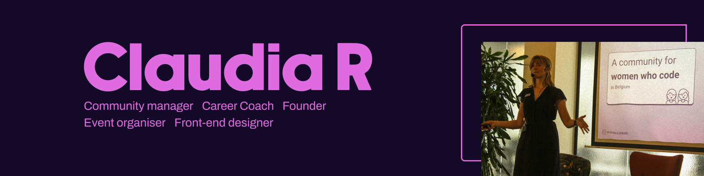

 

## **Short intro**
<table style="border:none">
<tr>
  <td style="vertical-align: top">
    
  </td>
  <td>
  </td>
  <td>
    
👩‍⚖️  Time-Series Processing, Forecasting, Analysis

👩‍⚖️  Data Visualization, Analysis, Cleaning

👩‍⚖️  Passionate about MLOps, AWS, Docker, Model research and development 

👩‍⚖️  Research Assistant, Machine Learning, Deep Learning Lab, NCUT; TSMC RD Engineer 

  </td>
</tr>
</table>

## **Long intro**

🪽 I am deeply interested in Artificial Intelligence, Deep Learning, Machine Learning, Time-Series Processing, Computer Vision, and Natural Language Processing, with prior research experience in Time-Series Prediction. My mission is to develop AI solutions to assist power companies in making electricity supply decisions.

📗During my master's program, I authored two papers on AI applications in the industry and participated in industry-academic collaborations, assisting a power company with data visualization and distribution decisions.

🖌️ I applied the R language for feature engineering and data visualization techniques to predict hospital patient readmissions. For the latter, I implemented an attention-based model in Python for text classification.

During my internship and employment at TSMC, I learned about the AI technologies and methods that can be applied in the industry, such as machine failure prediction and optimization of machine parameters

👉🏼 ***Feel free to follow me on [LinkedIn]([http://linkedin.aman.ai](https://www.linkedin.com/in/jiesi-yang-9218411aa/)) to stay updated with my latest AI learning resources.***
